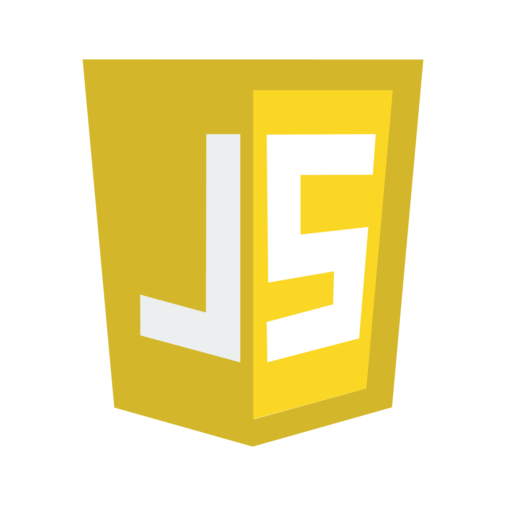
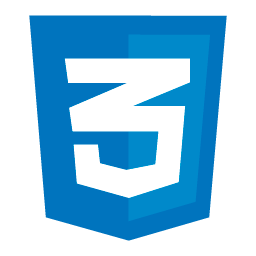

## Olá meu nome é Heberton Julio

-	✨ Comecei meu aprendizado em programação em 2024
-	🎓 Estudo Ciencia da Computacao na Universidade de São Paulo (UNICID)
-   🤖 No momento, apenas tenho projeto em Python, porém, irei dar enfase em JS,HTML & CSS.

